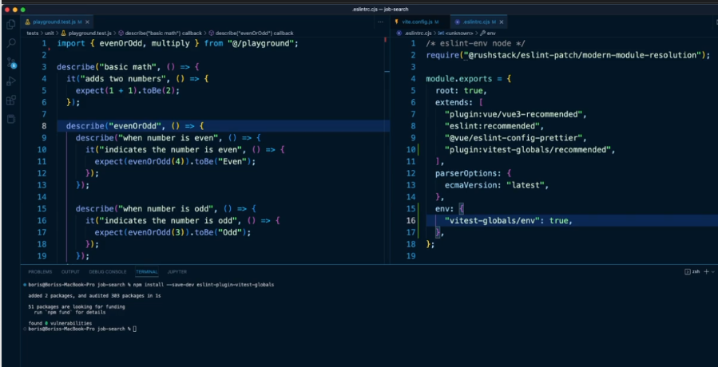

# Bonus: Intro to Vue3

- Vue 3

  - 
  - 

- Vitest

  - 
  - upon creating vue app in CLI terminal, config the configure the vitest to yes.
    - NOTE: the vue testing library is the integration link that actually going to allow us to connect Vitest with our component as the Vue testing library is going to render or mount vue components
      - Vue Test Utils --vue test to mount component outside of the browser. Integrates called jestDOM that renders a virtual DOM that will simulates a browser
      - DOM Testing Library --The DOM Testing Library is a very light-weight solution for testing DOM nodes (whether simulated with JSDOM as provided by default with Jest or in the browser). The main utilities it provides involve querying the DOM for nodes in a way that's similar to how the user finds elements on the page.

- Basic Syntax of Vitest Syntax

  - similarly with jest syntax
  - 

- Setup Vitest Globally

  - 
  - 

- Setup Vue Testing Library

  - installing vue testing library, jest-dom and user-event
    - 
    - 
    - 
  - instead using vue test utils that renders a component, in vitest we will be using vue testing library that serves the exact purpose of vue test utils. Basically, Vue Testing Library has test utils within it and it then it just adds certain functionality on top of it and strips other functionality from vue test utils that it doesnt like
  - NOTE: cleanup() --clean test after every single test that run --tear down the complete DOM including any rendered components so that when the next test begins we have a clean slate

- The render() Function and screen() Object

  - 
  - 
  - 
  - render() --pass the component that we want vue testing library to render to the virtual DOM
  - screen() --representation of current HTML mark up --object that were going to use to query the DOM --able to use to look within the HTML markup or element to identify certain pieces --basically a bunch of methods for searching the resulting HTML for specific elements or things that we're looking for.
    - debug() --it will output the current HTML as it stands within the component --as we interact with the component, use screen.debug() to observe how the component changes as we interact

- ARIA Roles

  - 
  - 
  - 
  - What is a role? a role is a responsibility --going to focused on the use case like what is it delivering or how it benefiting the user --it kind of describe the purpose of what that element is supposed to serve and that can be beneficial because sometimes the ways that we write are HTML is not really going to be semantically perfect
    - HTML element exist for us as the developer in order to create the web page while the role is more focused on the responsibility of a certain section or element
    - what makes it more confusing is sometimes the HTML element is going to be the exact same name as the corresponding role and the browser will try to assign (browser will automatically try to assign ARIA roles to every element in our markup). eg. button,each HTML element will automatically be assigned an ARIA role of button as well,
    - but for other things there is going to be a difference e.g if we have an input with a type of text that is the HTML element. But the ARIA role that the browser will assign to it is called textbox because that describes the purpose for the user
    - 
    - 

- Install Testing Playground Extension

  - powerful chrome extension that can help identify ARIA roles for a given element on web page and also generate the test code that will need in Vue testing library
  - Testing Playground --is an extension that actually going to support not just Vue testing library but the entire testing ecosystem

- The queryBy() Methods from Vue Testing Library

  - difference between getByRole() is strictly for one element only not for many elements, while queryByRole() can one or more by simply adding config object specified to certain element as 2nd argument
  - 

- The userEvent() Library
  - 
  - 
  - 
